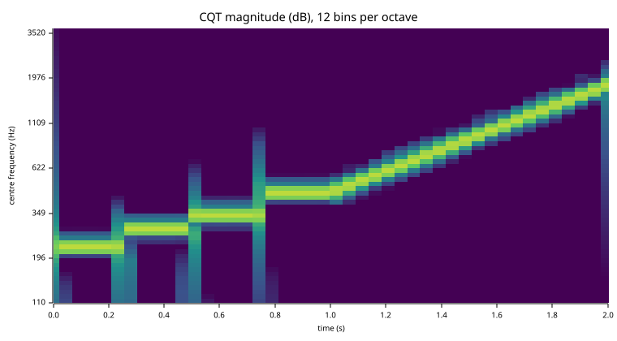
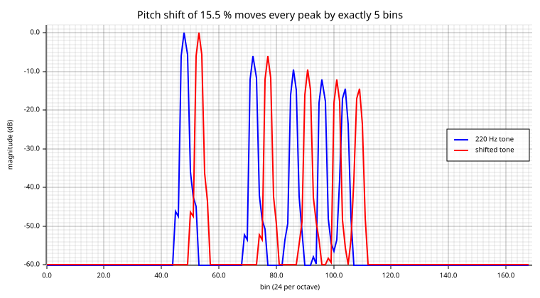

# cqt-rs

Constant-Q transform (CQT) for audio fingerprinting and real-time spectral
monitoring, in safe Rust.

[API documentation](https://docs.rs/cqt-rs) · [Changelog](./CHANGELOG.md)

The transform maps a signal onto a logarithmic frequency grid with a fixed
number of bins per octave. Every bin has its own analysis window whose length
is inversely proportional to its centre frequency, so all bins share one
quality factor `Q`. Two consequences make the representation a good front end
for fingerprinting:

- a pitch shift of the audio is a translation along the bin axis;
- a tempo change is a translation along the frame axis.

<p align="center">
  
  
</p>

## Installation

```toml
[dependencies]
cqt-rs = "0.2"
```

cqt-rs 0.2 requires Rust 1.98 or newer. The `parallel` feature (enabled by
default) processes batch frames on a rayon thread pool; disable default
features for a single-threaded build.

## Usage

### Batch

```rust
use cqt_rs::{Cqt, CqtParams};

let params = CqtParams::builder(44_100, 55.0, 7_040.0)
    .bins_per_octave(24)
    .build()?;
let cqt = Cqt::new(params);

let signal: Vec<f32> = load_audio();
let hop = 512;
let magnitudes = cqt.process(&signal, hop)?; // ndarray (frames, bins)
```

Frame `i` is centred on sample `i * hop`, and the signal is zero padded so
`1 + signal.len() / hop` frames are produced. A real sinusoid of amplitude `A`
at a bin's centre frequency reads as magnitude `A` in that bin.
`Cqt::process_complex` returns the complex coefficients instead. When many
signals are processed in a row, `Cqt::process_with` reuses a `CqtWorkspace`
so the decimation buffers are not reallocated per call.

### Real-time streaming

```rust
use cqt_rs::{Cqt, CqtParams, CqtStream};

let cqt = Cqt::new(CqtParams::new(44_100, 55.0, 7_040.0, 24)?);
let mut stream = CqtStream::new(&cqt, 512)?;

// In the capture callback, with blocks of any size:
stream.push(&cqt, block, |magnitudes| {
    // one call per completed frame, in order, no allocation
});

// At the end of the recording, to match `Cqt::process` exactly:
stream.flush(&cqt, |magnitudes| { /* trailing frames */ });
```

The stream emits frame `i` once sample `i * hop + latency` has arrived,
where `latency` is `cqt.latency_samples()`: half the longest analysis window
plus the decimation filter delay. Output is bit-identical to the batch path
regardless of how the audio is chunked.

### Parameters

| Builder method | Default | Effect |
| --- | --- | --- |
| `CqtParams::builder(sample_rate, min_freq, max_freq)` | | Sample rate in Hz and the centre frequencies of the lowest bin and the upper bound of the grid |
| `bins_per_octave(n)` | 12 | Frequency resolution; 24 or 36 lets small pitch shifts land on integer bin offsets |
| `filter_scale(s)` | 1.0 | Multiplies every window length; below one trades frequency resolution for time resolution |
| `gamma(hz)` | 0.0 | Adds a constant bandwidth (variable-Q transform); shortens low-frequency windows, cutting latency |
| `sparsity(f)` | 0.01 | Fraction of each kernel's spectral L1 mass that may be dropped |
| `max_kernel_length(n)` | none | Caps every window at `n` samples |
| `multirate(b)` | true | Analyse each octave at its own halved sample rate (see below) |

`build()` validates everything, including that the highest filter's pass-band
stays below the Nyquist frequency.

### Fingerprinting notes

- Use 24 to 36 bins per octave so a pitch shift of a few percent becomes an
  integer bin offset. The `pitch_shift_translates_bins` test shows that a
  shift of `k` bins moves every harmonic by exactly `k` bins.
- Choose the hop for the time resolution of your hashes; latency does not
  depend on it. Hops that are a multiple of `cqt.hop_alignment()` give every
  frame the same latency.
- `gamma` around 10–25 Hz lowers latency from hundreds of milliseconds to
  tens of milliseconds by shortening the sub-200 Hz windows, which rarely
  carry fingerprint peaks.
- Convert magnitudes with `magnitude_to_db` before peak picking so that
  clipping, compression and codec artefacts change peak levels by a couple of
  dB rather than by orders of magnitude (see `tests/robustness.rs`).

## How it works

Each bin `k` is a Hann-windowed complex exponential `a_k` of length
`Q · sr / f_k`. Following Brown & Puckette (1992), the inner product of a frame
with every `a_k` is evaluated in the frequency domain: one real FFT of the
frame, then a sparse product with the precomputed spectrum of each `a_k`. The
kernels are built in `f64`, pruned to the coefficients that carry 99 % of
their spectral L1 mass, and stored as contiguous runs.

With one FFT for the whole range, short high-frequency kernels spread over
thousands of FFT bins, so by default the transform is multi-rate (Schörkhuber
& Klapuri, 2010): the top octave is analysed at the full rate, the signal is
low-passed with an 80 dB Kaiser half-band filter and decimated by two, and
the next octave is analysed at half the rate with an FFT of the same small
size. The half-band filter runs as a polyphase block filter, so it
vectorizes, and decimation is zero-phase, which is what keeps the batch and
streaming outputs bit-identical. `multirate(false)` selects the single-FFT
engine, which the tests use as the exact reference; the multi-rate output
agrees with it to within 1 % of the frame's peak magnitude.

## Benchmarks

Measured with `cargo bench` on a 4-core container (Rust 1.98). Times are
criterion estimates. Per-frame numbers are single-threaded; batch numbers use
the rayon pool.

| Configuration | Bins | Levels | FFT lengths | Non-zeros | Build | Stream, per frame | Batch |
| --- | ---: | ---: | --- | ---: | ---: | ---: | ---: |
| Legacy grid (14.6–7902 Hz, 12/oct, 22 kHz, hop 1760) | 109 | 10 | 64, 128 × 9 | 1 323 | 0.67 ms | 9.3 µs | 4.06 ms, 1.74 ms with a reused workspace (30 s) |
| Same grid, single-rate | 109 | 1 | 32768 | 70 990 | 45.4 ms | 158 µs | 15.7 ms (30 s) |
| Same grid, kernels capped at 2048 | 109 | 9 | 8–128 | 1 038 | 0.53 ms | | 1.93 ms (30 s) |
| Fingerprint (55–7040 Hz, 24/oct, 44.1 kHz, hop 512) | 169 | 8 | 256, 512 × 7 | 1 891 | 2.0 ms | 10.1 µs | 2.94 ms (10 s) |

For comparison, version 0.1 on the same machine and legacy grid needed
1.50 ms to build its filterbank and 7.44 ms for the 30 s batch, while using
one 2048-sample window for every bin (so it was not constant-Q) and the
rayon pool for both. The 0.2 multi-rate engine processes the same audio
1.8× faster (4.3× with a reused workspace) with true constant-Q
resolution, and the streaming path handles a frame in 9.3 µs, which at hop
1760 is about 0.01 % of one core.

Regenerate the figures with:

```console
cargo run --release --example generate_plots
```

## References

- J. C. Brown, "Calculation of a constant Q spectral transform", JASA 1991.
- J. C. Brown and M. S. Puckette, "An efficient algorithm for the calculation
  of a constant Q transform", JASA 1992.
- C. Schörkhuber and A. Klapuri, "Constant-Q transform toolbox for music
  processing", SMC 2010.
- C. Schörkhuber, A. Klapuri, N. Holighaus and M. Dörfler, "A Matlab toolbox
  for efficient perfect reconstruction time-frequency transforms with
  log-frequency resolution", AES 2014 (variable-Q).

## License

MIT
