# cqt-rs

Constant-Q transform (CQT) for audio fingerprinting and real-time spectral
monitoring, in safe Rust.

[API documentation](https://docs.rs/cqt-rs) · [Changelog](./CHANGELOG.md)

The transform maps a signal onto a logarithmic frequency grid with a fixed
number of bins per octave. Every bin has its own analysis window whose length
is inversely proportional to its centre frequency, so all bins share one
quality factor `Q`. Two consequences make the representation a good front end
for fingerprinting:

- a pitch shift of the audio is a translation along the bin axis;
- a tempo change is a translation along the frame axis.

<p align="center">
  
  
</p>

## Installation

```toml
[dependencies]
cqt-rs = "0.2"
```

cqt-rs 0.2 requires Rust 1.98 or newer. The `parallel` feature (enabled by
default) processes batch frames on a rayon thread pool; disable default
features for a single-threaded build.

## Usage

### Batch

```rust
use cqt_rs::{Cqt, CqtParams};

let params = CqtParams::builder(44_100, 55.0, 7_040.0)
    .bins_per_octave(24)
    .build()?;
let cqt = Cqt::new(params);

let signal: Vec<f32> = load_audio();
let hop = 512;
let magnitudes = cqt.process(&signal, hop)?; // ndarray (frames, bins)
```

Frame `i` is centred on sample `i * hop`, and the signal is zero padded so
`1 + signal.len() / hop` frames are produced. A real sinusoid of amplitude `A`
at a bin's centre frequency reads as magnitude `A` in that bin.
`Cqt::process_complex` returns the complex coefficients instead. When many
signals are processed in a row, `Cqt::process_with` reuses a `CqtWorkspace`
so the decimation buffers are not reallocated per call.

### Real-time streaming

```rust
use cqt_rs::{Cqt, CqtParams, CqtStream};

let cqt = Cqt::new(CqtParams::new(44_100, 55.0, 7_040.0, 24)?);
let mut stream = CqtStream::new(&cqt, 512)?;

// In the capture callback, with blocks of any size:
stream.push(&cqt, block, |magnitudes| {
    // one call per completed frame, in order, no allocation
});

// At the end of the recording, to match `Cqt::process` exactly:
stream.flush(&cqt, |magnitudes| { /* trailing frames */ });
```

The stream emits frame `i` once sample `i * hop + latency` has arrived,
where `latency` is `cqt.latency_samples()`: half the longest analysis window
plus the decimation filter delay. Output is bit-identical to the batch path
regardless of how the audio is chunked.

### Parameters

| Builder method | Default | Effect |
| --- | --- | --- |
| `CqtParams::builder(sample_rate, min_freq, max_freq)` | | Sample rate in Hz and the centre frequencies of the lowest bin and the upper bound of the grid |
| `bins_per_octave(n)` | 12 | Frequency resolution; 24 or 36 lets small pitch shifts land on integer bin offsets |
| `filter_scale(s)` | 1.0 | Multiplies every window length; below one trades frequency resolution for time resolution |
| `gamma(hz)` | 0.0 | Adds a constant bandwidth (variable-Q transform); shortens low-frequency windows, cutting latency |
| `sparsity(f)` | 0.01 | Fraction of each kernel's spectral L1 mass that may be dropped |
| `max_kernel_length(n)` | none | Caps every window at `n` samples |
| `multirate(b)` | true | Analyse each octave at its own halved sample rate (see below) |

`build()` validates everything, including that the highest filter's pass-band
stays below the Nyquist frequency. The window length per bin under the three
settings that change it (the fingerprint grid at 44.1 kHz, `gamma` 20 Hz cuts
the 55 Hz window from 33 000 to 4 000 samples, a cap flattens the low end):

<p align="center">
  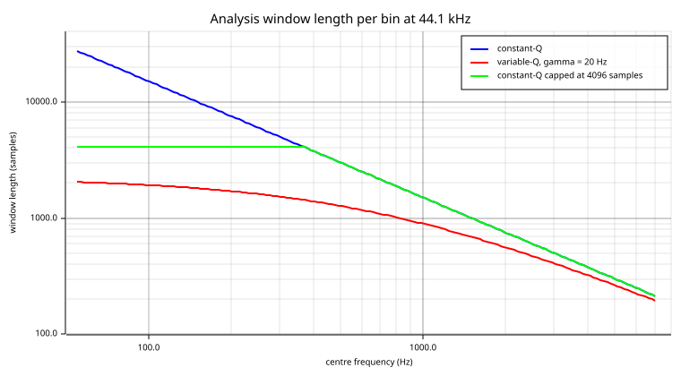
</p>

### Fingerprinting notes

- Use 24 to 36 bins per octave so a pitch shift of a few percent becomes an
  integer bin offset. The `pitch_shift_translates_bins` test shows that a
  shift of `k` bins moves every harmonic by exactly `k` bins.
- Choose the hop for the time resolution of your hashes; latency does not
  depend on it. Hops that are a multiple of `cqt.hop_alignment()` give every
  frame the same latency.
- `gamma` around 10–25 Hz lowers latency from hundreds of milliseconds to
  tens of milliseconds by shortening the sub-200 Hz windows, which rarely
  carry fingerprint peaks.
- Convert magnitudes with `magnitude_to_db` before peak picking so that
  clipping, compression and codec artefacts change peak levels by a couple of
  dB rather than by orders of magnitude (see `tests/robustness.rs`).

## How it works

Each bin `k` is a Hann-windowed complex exponential `a_k` of length
`Q · sr / f_k`. Following Brown & Puckette (1992), the inner product of a frame
with every `a_k` is evaluated in the frequency domain: one real FFT of the
frame, then a sparse product with the precomputed spectrum of each `a_k`. The
kernels are built in `f64`, pruned to the coefficients that carry 99 % of
their spectral L1 mass, and stored as contiguous runs.

With one FFT for the whole range, short high-frequency kernels spread over
thousands of FFT bins, so by default the transform is multi-rate (Schörkhuber
& Klapuri, 2010): the top octave is analysed at the full rate, the signal is
low-passed with an 80 dB Kaiser half-band filter and decimated by two, and
the next octave is analysed at half the rate with an FFT of the same small
size. The half-band filter runs as a polyphase block filter, so it
vectorizes, and decimation is zero-phase, which is what keeps the batch and
streaming outputs bit-identical. `multirate(false)` selects the single-FFT
engine, which the tests use as the exact reference; the multi-rate output
agrees with it to within 1 % of the frame's peak magnitude.

## Benchmarks

Measured with `cargo bench` on a 4-core container (Rust 1.98). Times are
criterion estimates. Per-frame numbers are single-threaded; batch numbers use
the rayon pool.

| Configuration | Bins | Levels | FFT lengths | Non-zeros | Build | Stream, per frame | Batch |
| --- | ---: | ---: | --- | ---: | ---: | ---: | ---: |
| Legacy grid (14.6–7902 Hz, 12/oct, 22 kHz, hop 1760) | 109 | 10 | 64, 128 × 9 | 1 323 | 0.67 ms | 9.3 µs | 4.06 ms, 1.74 ms with a reused workspace (30 s) |
| Same grid, single-rate | 109 | 1 | 32768 | 70 990 | 45.4 ms | 158 µs | 15.7 ms (30 s) |
| Same grid, kernels capped at 2048 | 109 | 9 | 8–128 | 1 038 | 0.53 ms | | 1.93 ms (30 s) |
| Fingerprint (55–7040 Hz, 24/oct, 44.1 kHz, hop 512) | 169 | 8 | 256, 512 × 7 | 1 891 | 2.0 ms | 10.1 µs | 2.94 ms (10 s) |

The monitor's index (`cargo bench -p cqt-monitor`, `monitor/benches/index.rs`)
answers 4 096 tolerant lookups (27 probes each) in 2.8 ms when every key
hits and 0.55 ms when none does, about 0.7 µs per lookup; the null stream
performs about 1 400 lookups per second.

For comparison, version 0.1 on the same machine and legacy grid needed
1.50 ms to build its filterbank and 7.44 ms for the 30 s batch, while using
one 2048-sample window for every bin (so it was not constant-Q) and the
rayon pool for both. The 0.2 multi-rate engine processes the same audio
1.8× faster (4.3× with a reused workspace) with true constant-Q
resolution, and the streaming path handles a frame in 9.3 µs, which at hop
1760 is about 0.01 % of the hop's audio duration in elapsed wall time.

Regenerate the figures with:

```console
cargo run --release --example generate_plots
```

## Validation on real music

`scripts/fingerprint_demo.py` runs the transform (through
`examples/cqt_dump.rs`) on a 30 s excerpt of *Vibe Ace* by Kevin MacLeod
(CC BY 3.0, fetched from the librosa example-data repository), which serves
as the reference. Modified versions of the excerpt, the other half of the
same song, and an unrelated piece (*Dance of the Sugar Plum Fairy*, Kevin
MacLeod, CC BY 3.0) are cut into 10 s chunks, and every chunk is matched
against the reference on its own. Spectrograms use hop 256. Peaks are
local maxima that stand 15 dB above the mean of their ±24 frame × ±9 bin
neighbourhood, a prominence rule that adapts to quiet passages, a raised
noise floor and the side lobes of clipping alike. Fingerprints are pitch-
and tempo-invariant peak triplets (two bin differences plus the time ratio
quantized to 1/32, as in Panako) looked up with ±1 bin and ±1 ratio step of
tolerance; the tempo of a match is the ratio of the two triplets' time
spans, the pitch shift and tempo are chosen by vote, and the position
follows from `t_ref = tempo · t_query + offset`.

Accuracy: after dividing out librosa's per-filter length scaling, the two
spectrograms agree to a mean 0.20 dB (0.13 dB on components above −40 dB)
with a correlation of 0.9996, and the linear gain ratio is 1.009.

<p align="center">
  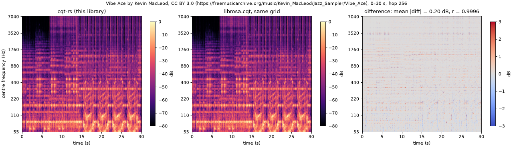
</p>

Score = consistent hashes / hashes of the chunk. "Peaks kept" is the share
of the chunk's peaks that have a counterpart in the reference after the
detected mapping; a triplet survives only if all three of its peaks do, so
the score is bounded by roughly its cube. "Located" is the detected start
of the chunk in the reference, expected value in parentheses.

| Version | Chunk 1 | Chunk 2 | Chunk 3 | Mean | Peaks kept | Shift applied / detected | Tempo applied / detected | Located at (expected) |
| --- | ---: | ---: | ---: | ---: | ---: | ---: | ---: | --- |
| original | 92.5 % | 53.8 % | 56.8 % | 67.7 % | 96/86/87 % | +0 / +0/+0/+0 | ×1.00 / 1.000/1.000/1.000 | 0.0 (0.0), 10.0 (10.0), 20.0 (20.0) s |
| pitch +2 semitones | 13.7 % | 14.0 % | 19.9 % | 15.8 % | 57/60/73 % | +4 / +4/+4/+4 | ×1.00 / 1.000/1.000/1.000 | 0.0 (0.0), 10.0 (10.0), 20.0 (20.0) s |
| pitch −1 semitone | 15.8 % | 12.8 % | 10.9 % | 13.2 % | 58/62/58 % | −2 / −2/−2/−2 | ×1.00 / 1.000/1.000/1.000 | 0.0 (0.0), 10.0 (10.0), 20.0 (20.0) s |
| tempo +12 % | 16.7 % | 12.0 % | 12.0 % | 13.5 % | 59/56/61 % | +0 / +0/+0/+0 | ×1.12 / 1.117/1.115/1.115 | 0.0 (0.0), 11.2 (11.2), 22.4 (22.4) s |
| tempo −8 % | 13.5 % | 12.4 % | 14.5 % | 13.5 % | 54/54/62 % | +0 / +0/+0/+0 | ×0.92 / 0.919/0.918/0.923 | 0.0 (0.0), 9.2 (9.2), 18.4 (18.4) s |
| speed +6 % (resampled) | 67.5 % | 60.6 % | 54.3 % | 60.8 % | 89/90/88 % | +2 / +2/+2/+2 | ×1.06 / 1.060/1.059/1.059 | 0.0 (0.0), 10.6 (10.6), 21.2 (21.2) s |
| hard clip at 0.2 | 64.6 % | 30.0 % | 28.7 % | 41.1 % | 85/73/75 % | +0 / +0/+0/+0 | ×1.00 / 1.000/1.000/1.000 | 0.0 (0.0), 10.0 (10.0), 20.0 (20.0) s |
| white noise, 10 dB SNR | 28.9 % | 26.3 % | 28.8 % | 28.0 % | 85/91/91 % | +0 / +0/+0/+0 | ×1.00 / 1.000/1.000/1.000 | 0.0 (0.0), 10.0 (10.0), 20.0 (20.0) s |
| same song, other 30 s | 13.5 % | 8.9 % | 13.8 % | 12.1 % | 56/40/60 % | +0 / +0/+0/+0 | ×1.00 / 1.000/1.000/1.000 | 19.4 (0.0), 11.0 (10.0), 21.0 (20.0) s |
| control (unrelated piece) | 0.1 % | 0.1 % | 0.1 % | 0.1 % | —/—/— % | +0 / —/—/— | ×1.00 / —/—/— | — (0.0), — (10.0), — (20.0) s |

Every chunk of every modified version is identified at 100× to 900× the
score of the unrelated piece, its pitch shift and tempo are recovered
exactly, and its position in the reference is found to within 0.1 s. The
chunks of the other half of the same song match at positions where the song
repeats its riffs, which is real shared content rather than a false
positive. Chunks 2 and 3 of the unmodified original score about 55 %
because triplets crossing a chunk edge are lost. The pitch-shifted and
time-stretched versions keep only about 60 % of their peaks, because the
phase vocoder smears transients, which caps their triplet scores near 20 %;
the resampled version, a clean transform, keeps 90 %.

For real-time monitoring the question is how much audio a decision needs.
Matching the first 1 to 10 s of the middle chunk of every version, the
evidence for the true reference exceeds the unrelated piece by an order of
magnitude after 2 to 3 s and by two orders after 6 s, while the unrelated
piece stays at about ten stray matches however long the query grows.

<p align="center">
  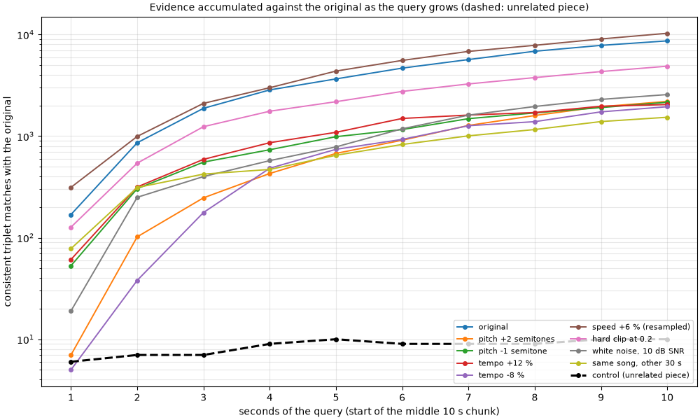
</p>

<p align="center">
  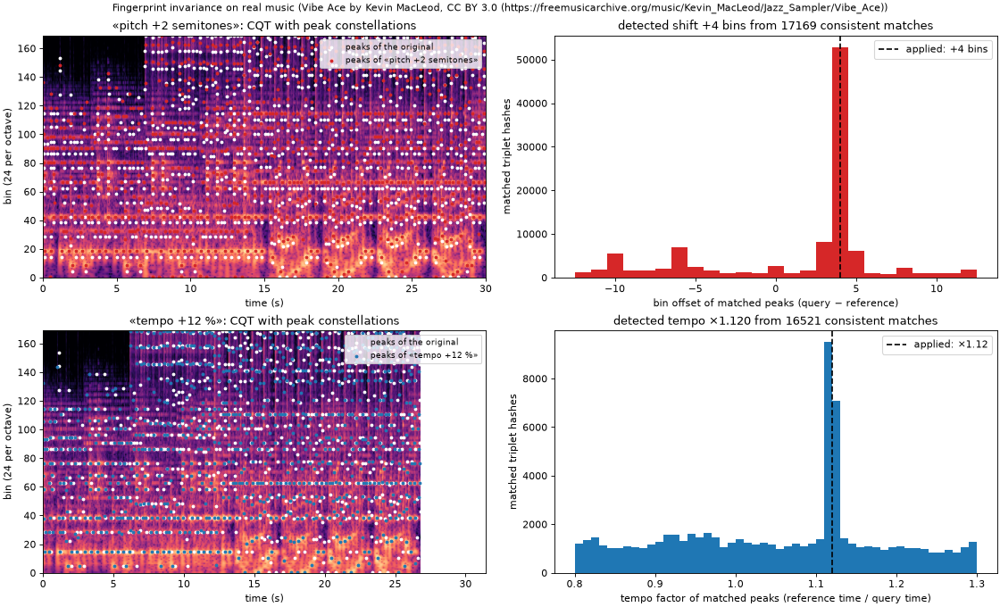
</p>
<p align="center">
  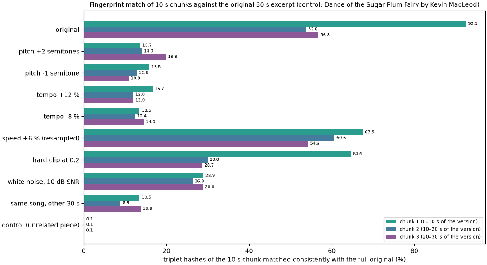
</p>

Engineering notes with the reasoning behind these choices and the next
steps for a fingerprinting layer are in [`docs/NOTES.md`](./docs/NOTES.md).

Reproduce with:

```console
pip install numpy scipy soundfile librosa matplotlib
python3 scripts/fingerprint_demo.py
```

## Radio monitoring with a watch list

**TL;DR.** Give the monitor the songs you care about and a stream, and it
tells you when one of them is playing, with a confidence score from 0 to
100 in which anything under 70 is not a match. On simulated radio it
found every play of the watched songs (16 of 16 on a 15 min programme,
45 of 45 with eight songs watched, 9 of 9 in a continuous DJ set) with no
false alarm in 76 minutes of audio without the songs, drawn from the
same eight tracks and three speech recordings as everything else here,
so this is development validation rather than an independent test: a
pitch fader of
±8 %, a key-locked BPM change of ±12 %, a key change of ±2 semitones, a
bass cut, an FM chain and a 128k MP3 are each recognised within about
2 s of the song becoming audible, with the pitch shift, the tempo and
the position in the song reported. A DJ who changes the BPM *and* the
key *and* talks over the intro is recognised 1 to 8 s after the talking
stops, once during it (the worst case, everything at once through FM
and MP3, takes 18 s). The measured processing wall time is 0.4 % of audio duration, and
`--stream -` reads live PCM from a decoder.

The `cqt-monitor` crate in [`monitor/`](./monitor) turns the transform into
a real-time watch-list monitor: given the songs you want to catch, it
listens to a stream and reports when one of them is playing, how the DJ
pitched and stretched it, where in the song the stream is, and a
confidence score. Everything is streaming with a bounded delay and no
allocation per frame.

| Stage | What it does | Delay |
| --- | --- | ---: |
| `CqtStream` | 55–7040 Hz, 24 bins per octave, hop 256 | 0.39 s |
| `PeakPicker` | local maxima 15 dB above the mean of a ±24 frame × ±9 bin neighbourhood | 0.14 s |
| `TripletHasher` | pitch- and tempo-invariant triplet hashes, zone 320 frames, fan-out 4 | ≤ 1.86 s, median 0.7 s |
| `Index` | hash table over the watched songs, ±1 bin and ±1 ratio-step lookups | |
| `Matcher` | 5 s sliding vote over (song, pitch shift, tempo, position) | |
| `PeakTrack` | aligns the last 2 s of stream peaks with the song's peaks under the winning hypothesis | |

An anchor's hashes are emitted as soon as its candidate peaks are known,
so in normal music the hasher waits under a second rather than the full
zone. The evidence for a song is the number of consistent hash matches in
the window. The confidence is `100 · n / (n + half)`, with `half`
calibrated on audio that contains none of the watched songs: at twice the
largest evidence ever seen there, false matches stay below 34 while a
watched song reads above 70 within seconds. The winning hypothesis is
then checked directly: the fraction of the most recent peaks that land on
a peak of the song at the predicted place (the *alignment*). A `Tracker`
turns the running scores into `start`/`end` events per song: a play
starts at confidence 70 with an alignment of at least 0.4, and it
survives a quiet passage as long as the peaks still align. The `monitor`
binary prints one JSON line per report interval plus those events.

```console
cargo run --release -p cqt-monitor -- --watch song=song.wav --watch other=other.wav --stream radio.wav
ffmpeg -i https://radio.example/stream -f s16le -ac 1 -ar 44100 - | monitor --watch song=song.wav --stream -
```

With `--stream -` the monitor reads signed 16-bit mono PCM from stdin as
it arrives and flushes every report line, so it sits behind any decoder;
the events are the same as for a file (verified on the same audio both
ways).

### Simulated radio programme

`scripts/radio_sim.py` builds two streams from CC-licensed tracks: a 15 min
programme in which the two watched songs (*Vibe Ace*, *Sweet Waltz*) are
played 16 times between other songs and speech, each play with a DJ
treatment, and a 31 min null stream of other music and speech with the
same treatments and no watched song. Both streams go through an FM-style
chain (15 kHz low-pass, 4:1 broadcast compressor). `scripts/radio_eval.py`
runs the monitor over both and compares the detections with the ground
truth.

On the null stream the evidence never exceeds 20 (median 7), so `half` is
40; the highest confidence in 31 minutes is 33.3 and there is no false
alarm at the threshold of 70. On the programme all 16 plays are detected
with no false start:

| Song | Treatment | Detected after | Confidence at detection / max | Shift expected / detected | Tempo expected / detected | Alignment at detection |
| --- | --- | ---: | ---: | ---: | ---: | ---: |
| vibe_ace | clean | 1.8 s | 87 / 98 | +0 / +0 | ×1.000 / ×1.000 | 0.84 |
| sweet_waltz | pitch fader +6 % | 1.7 s | 77 / 98 | +2 / +2 | ×1.060 / ×1.066 | 0.55 |
| vibe_ace | pitch fader +6 % | 1.6 s | 82 / 98 | +2 / +2 | ×1.060 / ×1.062 | 0.59 |
| vibe_ace | pitch fader −8 % | 1.8 s | 76 / 98 | −3 / −3 | ×0.920 / ×0.923 | 0.67 |
| vibe_ace | key-locked tempo +10 % | 1.8 s | 72 / 95 | +0 / +0 | ×1.100 / ×1.097 | 0.73 |
| sweet_waltz | key change −1 semitone | 3.4 s | 71 / 94 | −2 / −2 | ×1.000 / ×0.999 | 0.68 |
| vibe_ace | key-locked tempo −8 % | 2.9 s | 74 / 93 | +0 / +0 | ×0.920 / ×0.916 | 0.64 |
| vibe_ace | key change +2 semitones | 3.6 s | 90 / 95 | +4 / +4 | ×1.000 / ×0.999 | 0.64 |
| vibe_ace | key change −1 semitone | 1.6 s | 77 / 93 | −2 / −2 | ×1.000 / ×0.997 | 0.67 |
| vibe_ace | pitch fader +4 % with 12 s of DJ talk-over | 13.3 s | 74 / 97 | +1 / +1 | ×1.040 / ×1.040 | 0.49 |
| vibe_ace | 6 s crossfade in and out | 7.5 s | 92 / 98 | +0 / +0 | ×1.000 / ×1.000 | 0.61 |
| vibe_ace | bass cut, FM chain, MP3 128k | 2.6 s | 75 / 98 | +0 / +0 | ×1.000 / ×0.997 | 0.67 |
| sweet_waltz | FM chain, MP3 128k | 1.5 s | 71 / 98 | +0 / +0 | ×1.000 / ×1.001 | 0.54 |
| vibe_ace | FM chain, MP3 128k | 1.7 s | 83 / 98 | +0 / +0 | ×1.000 / ×1.000 | 0.82 |
| vibe_ace | pitch fader +6 %, FM chain, MP3 | 2.6 s | 88 / 98 | +2 / +2 | ×1.060 / ×1.062 | 0.83 |
| sweet_waltz | pitch fader +6 %, FM chain, MP3 | 1.7 s | 78 / 98 | +2 / +2 | ×1.060 / ×1.066 | 0.77 |

"Detected after" is measured from the first sample of the play in the
stream, crossfade included, to the `start` event; it contains the
pipeline delay (0.4 s transform, 0.14 s picker, about 0.7 s hasher), so a
song is recognised from its first half-second of audible material, and
the reported position is within 0.1 s in every case. The two slow cases
are honest: the crossfade play is detected 1.5 s after its 6 s fade-in
completes (the alignment gate waits for the song to be audible), and the
talk-over play, where speech sits 3 dB above the ducked music for 12 s,
holds a confidence of 30–40 during the talking and is detected 1.3 s
after the speech stops.

The evidence threshold is calibrated on one null stream and checked on
two others that `scripts/radio_negatives.py` builds: a second 31 min null
programme with another seed, and 21 min of hard negatives. On the second
null stream the evidence again peaks at 20 with no false alarm. Two
caveats keep this honest: the streams are drawn from the same eight
tracks and three speech recordings by the same generator, so a new seed
reshuffles the playlist rather than supplying new material; and the
alignment thresholds of the tracker (0.4 to start, 0.3 to hold) were
chosen after looking at the alignment scores of all three negative
streams. This is development validation. An independent estimate of the
false-alarm rate needs the configuration frozen (it is, with these
defaults) and recordings that were used nowhere in development, which
is the first item on the list of next steps. The hard negatives sort into
what the monitor rejects and what it, by design, does not:

| Family | Minutes | Max evidence | Max confidence | Starts |
| --- | ---: | ---: | ---: | ---: |
| same artist (Kevin MacLeod's *Sugar Plum Fairy*, every treatment) | 6.5 | 14 | 26 | 0 |
| watched songs played backwards | 3.9 | 82 | 67 | 0 |
| watched songs at 0.6× and 1.5× speed (outside the 0.7–1.4 tempo range) | 3.1 | 58 | 59 | 0 |
| a 0.5 s sample of a watched song looped, alone or under another track | 2.0 | 122 | 75 | 0 |
| a 1 s loop | 2.0 | 397 | 91 | 0 |
| a 2 s loop | 1.9 | 1 089 | 97 | 3 (+4 on transitions between loop segments) |

A reversed copy shares the song's peaks and, in its symmetric passages,
enough hash votes to reach confidence 67; with fan-out 6 and no
alignment gate the same audio reached 72 and started twice. A looped
sample of a second or more *is* the song's audio and the matcher finds
it; whether that counts as a play is a policy question, and the periodic
jump of the reported position (once per loop) is the cue a stricter
policy would use.

<p align="center">
  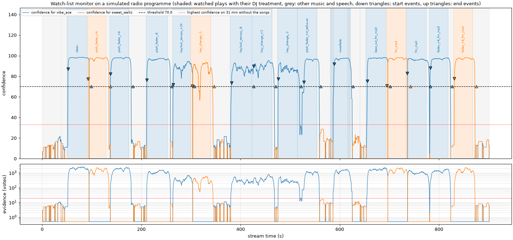
</p>
<p align="center">
  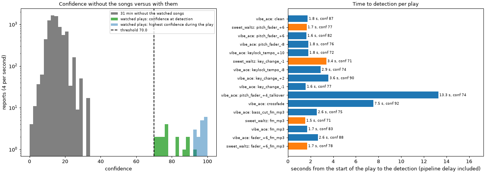
</p>

One panel per play, with the confidence, the alignment and the
`start`/`end` events against time from the first sample of the play:

<p align="center">
  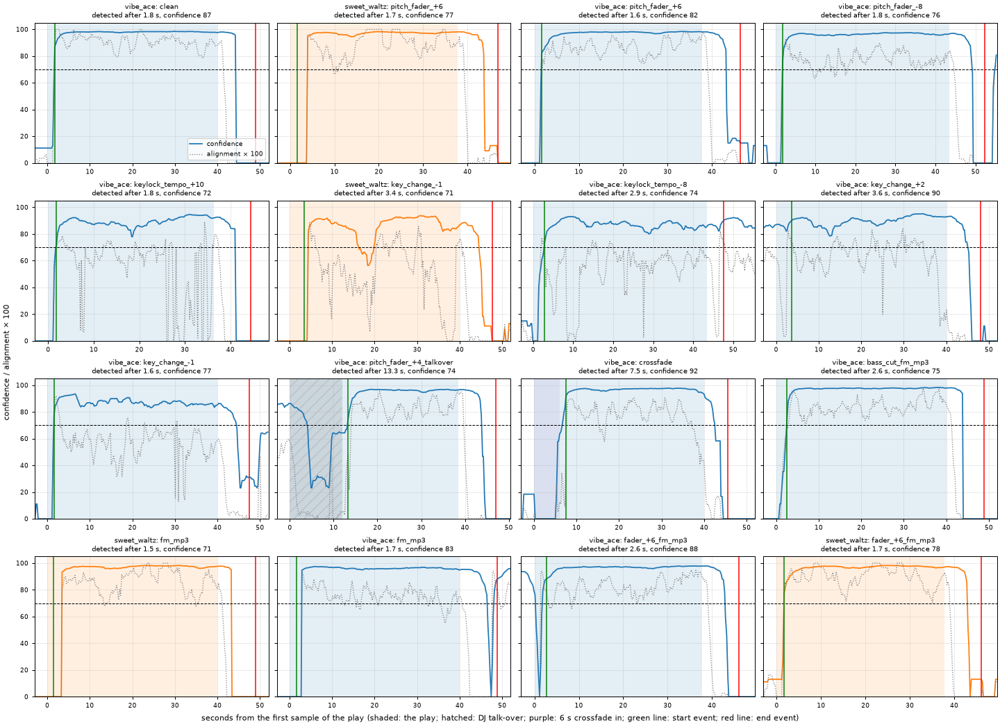
</p>

### A DJ set: BPM change, key change and talk-over at once

`scripts/radio_dj.py` renders the case the monitor is for: a continuous
8.7 min mix with no silence, every item crossfaded into the previous one
over 6 s, and the watched songs played with a key-locked BPM change *and*
a key change *and* 12 s of DJ talk-over over the incoming track at the
same time, in some plays through the FM chain and a 128k MP3 round trip
as well (`radio_eval.py --programme stream_dj`). All nine plays are
found with no false start:

| Song | BPM (key lock) | Pitch fader | Key | Talk-over | FM + MP3 | Detected after | after the talking / fade | Confidence at detection / max | Shift expected / detected | Tempo expected / detected |
| --- | ---: | ---: | ---: | :-: | :-: | ---: | ---: | ---: | ---: | ---: |
| vibe_ace | +12 % | | +2 | | | 7.0 s | 1.0 s | 71 / 86 | +4 / +4 | ×1.120 / ×1.101 |
| vibe_ace | | +5 % | −2 | | | 7.5 s | 1.5 s | 71 / 89 | −2 / −2 | ×1.050 / ×1.038 |
| sweet_waltz | | +5 % | −2 | | | 10.2 s | 4.2 s | 75 / 91 | −2 / −2 | ×1.050 / ×1.037 |
| vibe_ace | | −7 % | | ✓ | ✓ | 8.0 s | −4.0 s (during the talking) | 71 / 97 | −3 / −2 | ×0.930 / ×0.936 |
| vibe_ace | −6 % | | +1 | ✓ | | 14.2 s | 2.2 s | 70 / 90 | +2 / +2 | ×0.940 / ×0.939 |
| sweet_waltz | +8 % | | −1 | ✓ | ✓ | 15.9 s | 3.9 s | 70 / 83 | −2 / −2 | ×1.080 / ×1.086 |
| sweet_waltz | +8 % | | −1 | ✓ | | 17.6 s | 5.6 s | 71 / 88 | −2 / −2 | ×1.080 / ×1.080 |
| vibe_ace | +8 % | | −1 | ✓ | | 20.4 s | 8.4 s | 71 / 84 | −2 / −2 | ×1.080 / ×1.079 |
| vibe_ace | +8 % | | −1 | ✓ | ✓ | 29.6 s | 17.6 s | 80 / 81 | −2 / −2 | ×1.080 / ×1.082 |

"Detected after" counts from the first sample of the 6 s fade-in; the
next column counts from the moment the song is at full level, or from
the end of the 12 s talk-over when there is one. Two phase-vocoder
passes (key lock, then key change) keep fewer peaks than one, so these
plays sit at confidence 80–90 instead of 98, and the one play that adds
FM and MP3 on top of that hovers at 40–60 for fifteen seconds after the
talking before it crosses 70. The position is right within 0.1 s in
every play.

<p align="center">
  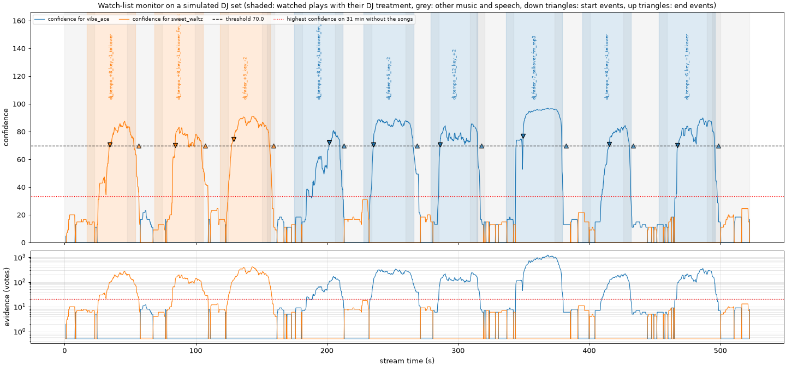
</p>
<p align="center">
  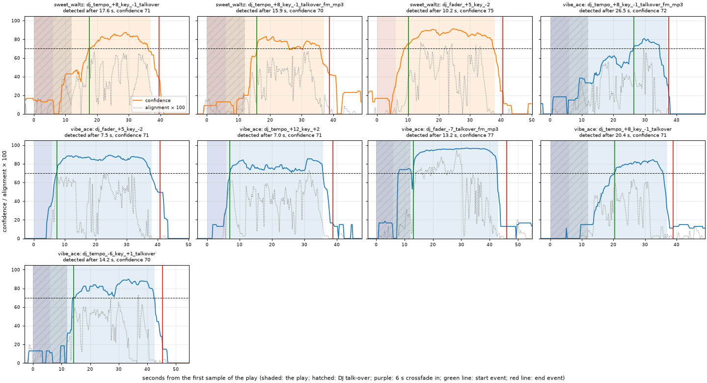
</p>

The evaluation records the evaluator commit and dirty status, the actual
monitor executable's SHA-256, hashes of the watch audio, query audio and
annotations, the monitor configuration, and report traces around the worst
cases. An external `--monitor` binary is identified by its hash; its source
commit is unknown. `scripts/radio_compare.py` checks matching input hashes
before plotting two runs. Older summaries require `--allow-unverified`,
which labels the comparison as unverified. The research goal and comparison
protocol are in [docs/GOAL.md](docs/GOAL.md).

Timing uses elapsed wall time divided by audio duration, not measured CPU
utilization. In live mode it includes input waits. The CLI's legacy
`cpu_seconds` field also contains wall time; historical figures that say
"CPU" should be read with this correction. Below, the monitor after the first
review round (fan-out 6, votes only) against the current default
(fan-out 4, alignment-gated tracker): detections move up to 0.7 s
earlier (median 2.3 s → 1.8 s), the null-stream ceiling drops from 50
to 20 votes, the index halves and processing wall time drops from 0.9 % to
0.4 % of audio duration.

For empty WAV or stdin input, the CLI emits `realtime_fraction: null`
because the ratio has no audio duration. Nonempty input retains a finite
numeric ratio, including very short streams displayed as 0.00 seconds.

<p align="center">
  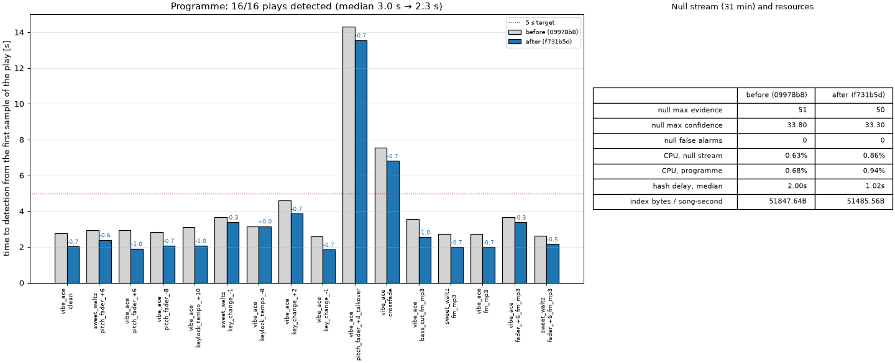
</p>

Resources: with two watched songs the whole chain takes wall time equal to
0.4 % of audio duration on both streams (44.1 kHz mono, one thread), and the index
costs about 4 MB per 3 minutes of watched audio. Watching all eight
music tracks of the simulation (8.5 minutes of audio, 7.5 MB) against
the 31 minute stream, which is built from six of them, detects all 45
plays with no extra start and no start outside a play (median 2.4 s,
worst 9.1 s) at 0.7 % wall time/audio duration (details in `docs/NOTES.md`). Larger
watch lists have not been measured.

## References

- J. C. Brown, "Calculation of a constant Q spectral transform", JASA 1991.
- J. C. Brown and M. S. Puckette, "An efficient algorithm for the calculation
  of a constant Q transform", JASA 1992.
- C. Schörkhuber and A. Klapuri, "Constant-Q transform toolbox for music
  processing", SMC 2010.
- C. Schörkhuber, A. Klapuri, N. Holighaus and M. Dörfler, "A Matlab toolbox
  for efficient perfect reconstruction time-frequency transforms with
  log-frequency resolution", AES 2014 (variable-Q).

## License

MIT
