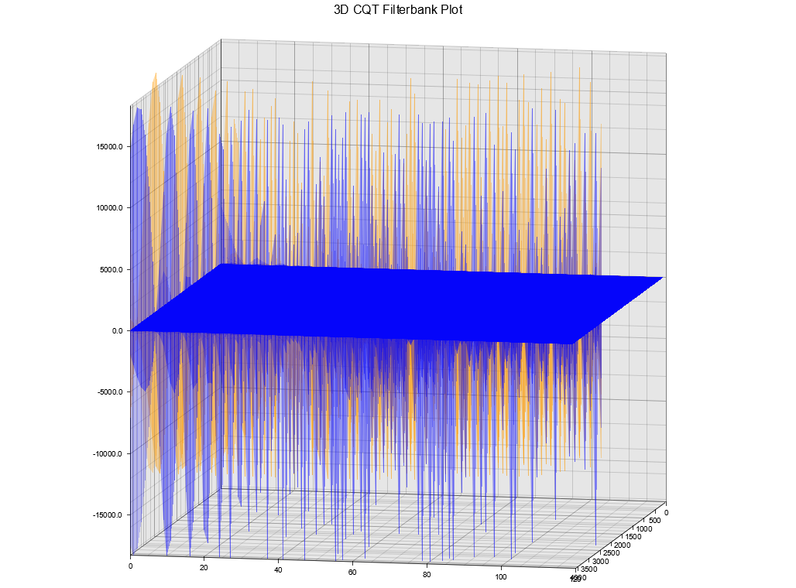

# cqt-rs (Constant-Q Transform)
This library provides an implementation of the Constant-Q Transform (CQT) for time-frequency analysis of audio signals. The CQT is a method for analyzing a signal in the time-frequency domain, where the frequency resolution is logarithmic. This library provides the necessary functions to compute a CQT filterbank and apply it to an input audio signal.

<p align="center">
  
  
  
</p>

<p align="center">
  
  
  
</p>

## Features
- Customizable CQT parameters, including:
  - Minimum and maximum frequencies
  - Number of bins
  - Sampling rate
  - Window length 
- Custom error handling for invalid parameters and FFT computation errors
- Parallelization for performance optimization

## Usage

1. Import the library:

```toml
[dependencies]
cqt-rs = "0.1.0"
```


```rust
use cqt_rs::{CQTParams, Cqt};
```

2. Create a `CQTParams` instance with the desired parameters:

```rust
let cqt_params = CQTParams::new(
    30.0, // Min frequency
    4000.0, // Max frequency
    12, // Number of bins
    44000.0, // Sampling rate
    4096.0 // Window length
).expect("Error creating CQTParams");
```

3. Create a `Cqt` instance using the `CQTParams`:

```rust
let cqt = Cqt::new(cqt_params);
```

4. Process an input audio signal using the `Cqt` instance:

```rust
let input_signal: Vec<f32> = vec![...]; // Your input audio signal
let hop_size = 512;
let cqt_features = cqt.process(&input_signal, hop_size).expect("Error computing CQT features");
```


## Error Handling
The functions `CQTParams::new` and `Cqt::process` return `Result` types, which can be used to handle errors related to invalid parameters, FFT computation errors, or other issues:

```rust
match CQTParams::new(...) {
    Ok(cqt_params) => {
        // Use the CQTParams
    },
    Err(error) => {
        println!("Error creating CQTParams: {:?}", error);
        // or handle the error in your way
    },
}
```

```rust
match cqt.process(&input_signal, hop_size) {
    Ok(cqt_features) => {
        // Use the CQT features
    },
    Err(error) => {
        println!("Error computing CQT features: {:?}", error);
        // or handle the error in your way
    },
}
```

## Dependencies
This library uses the following crates:
- `ndarray` for efficient array computations
- `rustfft` for FFT computation
- `hann-rs` crate for Hann window computation

## Performance

This implementation of the CQT is optimized for performance using parallelization with the `rayon` crate. The performance will depend on the input signal size, the chosen parameters, and your hardware.

### Benchmarks of **APPROXIMATE** results


|Metric  | Size | Minimum Time  | Average Time  | Maximum Time  |
:-------:|-----:|------------------:|------------------:|------------------:|
get_calculated_base_freq_ratio | 14 BO |  11.001 (ns) | 11.059 (ns) | 11.140 (ns) |
get_calculated_base_freq_ratio (Cached) | 12 BO  | 11.080 (ns) | 11.104 (ns) | 11.131 (ns) |


|Metric  | Size | Minimum Time  | Average Time  | Maximum Time  |
:-------:|-----:|------------------:|------------------:|------------------:|
get_calculated_phase_factors | 2000 WL, 22000 SR   |  2.2373 (µs) | 2.2450 ns (µs) | 2.2562 (µs) |
get_calculated_phase_factors | 4000 WL, 44000 SR   |  4.4032 (µs) | 4.4288 (µs) | 4.4652 (µs) |
get_calculated_phase_factors (Cached) | 2048 WL, 22050 SR   | 185.29 (ns) | 186.16 (ns) | 187.03 (ns) |
get_calculated_phase_factors (Cached) | 4096 WL, 44100 SR   | 381.80 (ns) | 385.20 (ns) | 389.52 (ns) |


|Metric  | Size | Minimum Time  | Average Time  | Maximum Time  |
:-------:|-----:|------------------:|------------------:|------------------:|
calculate_norm | 2000 HW |  612.50 (ns) | 614.34 (ns) | 616.49 (ns) |
calculate_norm | 4000 HW |  1.1675 (µs)| 1.1743 (µs) | 1.1857 (µs) |
calculate_norm (Cached) | 4096 HW  | 12.245 (ns) | 12.298 (ns) | 12.356 (ns) |


|Metric  | Size | Minimum Time  | Average Time  | Maximum Time  |
:-------:|-----:|------------------:|------------------:|------------------:|
get_calculated_q_factor | 14 BO |  10.727 (ns) | 10.752 (ns) | 10.782 (ns) |
get_calculated_q_factor (Cached) | 12 BO | 12.054 (ns) | 12.104 (ns) | 12.168 (ns) |


|Metric  | Size | Minimum Time  | Average Time  | Maximum Time  |
:-------:|-----:|------------------:|------------------:|------------------:|
create_complex_hann_window | 22000 SR, 2000 WL |  35.336 (µs) | 35.913 (µs) | 36.579 (µs) |
create_complex_hann_window | 44000 SR, 4000 WL |  43.626 (µs) | 44.265 (µs) | 44.999 (µs) |
create_complex_hann_window (Cached) |  22050 SR, 2048 WL  | 35.964 (µs) | 36.381 (µs) | 36.845 (µs) |
create_complex_hann_window (Cached) |  44100 SR, 4096 WL  | 43.111 (µs) | 43.552 (µs) | 44.017 (µs) |


|Metric  | Size | Minimum Time  | Average Time  | Maximum Time  |
:-------:|-----:|------------------:|------------------:|------------------:|
compute_cqt_filterbank | 22000 SR, 2000 WL |  1.3798 (ms) | 1.4057 (ms) | 1.4354 (ms) |
compute_cqt_filterbank | 44000 SR, 4000 WL |  2.5221 (ms) | 2.5737 (ms) | 2.6335 (ms) |
compute_cqt_filterbank (Cached) |  22050 SR, 2048 WL  | 1.3117 (ms) | 1.3387 (ms) | 1.3686 (ms) |
compute_cqt_filterbank (Cached) |  44100 SR, 4096 WL  | 2.6103 (ms) | 2.6785 (ms) | 2.7535 (ms) |

|Metric  | Size | Minimum Time  | Average Time  | Maximum Time  |
:-------:|-----:|------------------:|------------------:|------------------:|
cqt.process | 22000 SR, 2000 WL |  12.798 (ms) | 13.037 (ms) | 13.308 (ms) |
cqt.process | 44000 SR, 4000 WL |  47.653 (ms) | 48.368 (ms) | 49.191 (ms) |
cqt.process (Cached) |  22050 SR, 2048 WL  | 12.934 (ms) | 13.133 (ms) | 13.350 (ms) |
cqt.process (Cached) |  44100 SR, 4096 WL  | 45.214 (ms) | 45.842 (ms) | 46.548 (ms) |